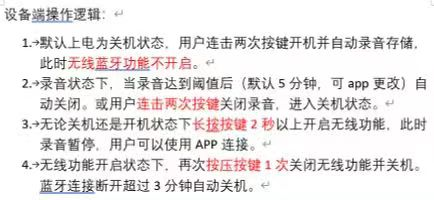

# Button and Working State

## 需求

下图是客户的原始需求。

## 需求分析与设计

下表是状态迁移表。大多数情况都是从`OFF`开始且回到`OFF`，唯一的例外是`RECORDING`可以通过一次长按进入`IDLE`，此时录音关闭。

| state/event | click | double click | press & hold | recordingState | subscriptionOn |
| ----------- | ----- | ------------ | ------------ | -------------- | -------------- |
| OFF         | -     | RECORDING    | IDLE         | -              | -              |
| RECORDING   | -     | OFF          | IDLE         | OFF            | -              |
| IDLE        | OFF   | -            | -            | -              | OFF            |

Button是事件源，通过旗语（Semaphore）控制audio和ble模块启动。Button通知audio模块启动和停止录音的方式不是对称的。启动录音通过在开始audio模块前设置`recordingState`完成，audio模块初始化时根据该变量状态（true）产生启动录音事件。停止录音通过`Audio_stopRecording`完成。

Button也是观察者，使用Polling方式观察。

1. 在预启动状态检测double click和long press，据此决定进入recording模式还是idle模式；
   1. 这是进入recording模式的唯一方式，先设置recordingState，然后post audio旗语；
   2. 如果是进入idle模式，则不设置recordingState，post两个旗语；
2. 在recording状态下，继续检测double click和long press，同时轮询`recordingState`；
   1. 如果double click，关机；
   2. 如果long press，通知audio停止录音，同时通过旗语启动ble；
   3. 如果`recordingState` false，关机；
3. 在idle状态下，检测click和subscriptionOn的状态；
   1. 如果subscriptionOn，清除累积的timeout；
   2. 如果subscriptionOff，累加time；如果达到180秒关机；
   3. 如果检测到click，关机；

## 一些实现上的细节

Button的状态检查使用两级数据结构。

第一级仅仅是debounce，例如使用4个bit，则连续30ms会sample 4次，连续的4个bits都是pressed，返回1，连续4次都是released，返回-1，如果无法确定则返回0。

第二级把数据累加到一个4个slot的数组里，实际代码使用5个slot的数组，最后一个slot，btn[4]，一直为0，相当于null termination，方便编码。

每次第一级读取完成后，如果返回结果为0，则btn[3]自动

Special Cases

## Initial detection

Initial detection和其它detection不同在于：要近可能早的检测negative情况，并据此关机（OFF->OFF状态迁移）。

根据需求，判断press-and-hold的

