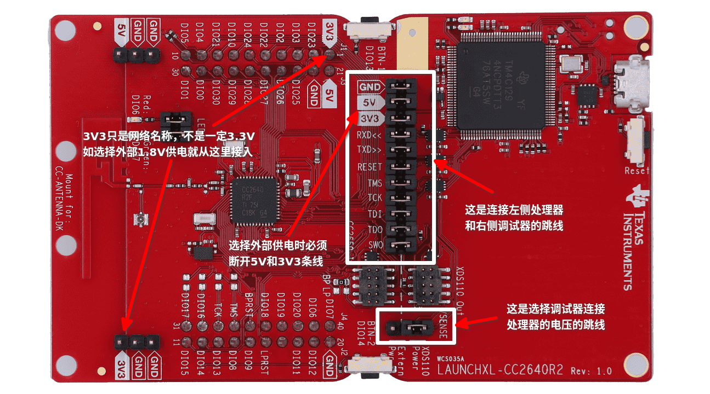
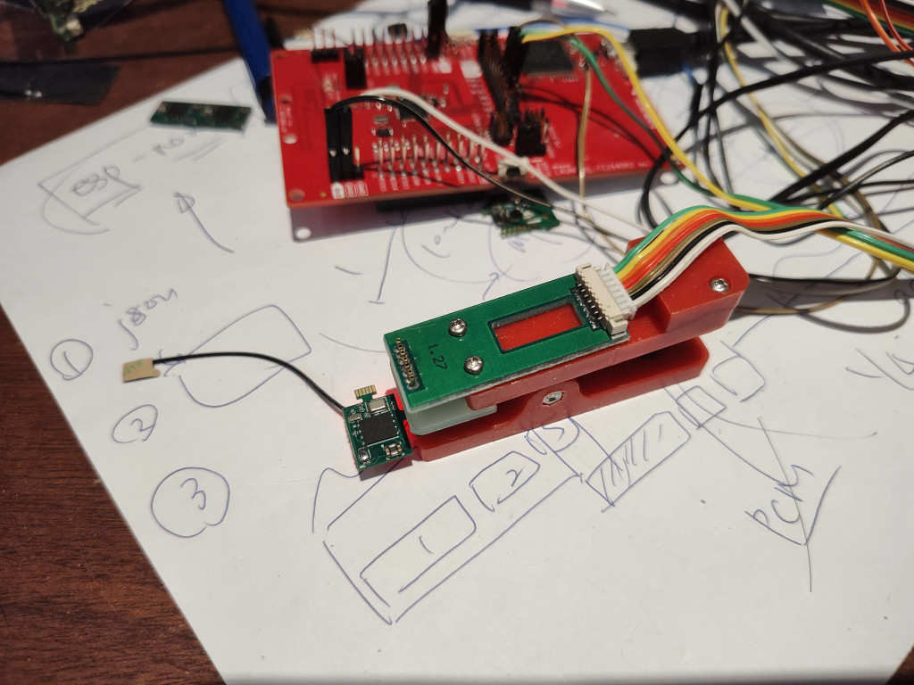
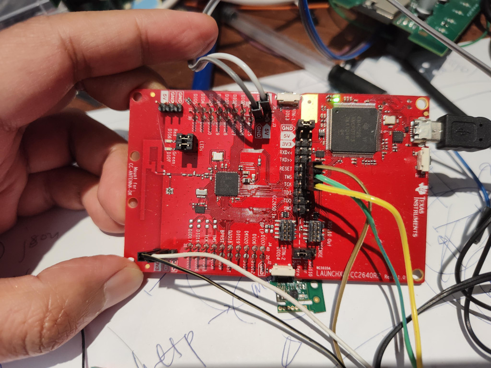

# 调试连线说明

## 文档说明

本文档描述通过开发板下载固件到录音项目目标板上的方法，和连接USB串口适配器把固件的打印信息输出到电脑上的方法。

测试人员可以根据本文档描述连接好所有硬件交付给App开发者，强烈建议App开发者在调试时观察串口输出，串口输出有数据包的解析结果可以比对，或者方便开发测试人员根据文档使用nRF Connect调试基础功能。

## Launchpad

下图是TI的CC2640R2-Launchpad开发板（简称Launchpad或LP板）。

这块开发板板载一个CC2640R2处理器（左侧方型芯片），和一个调试器（右侧方型芯片）。如果开发的程序可以在这个处理器上跑，就可以直接使用这个开发板完成全部开发工作，使用图中所示的缺省跳线状态即可。

对于录音项目，有一块专门的目标板，包含一个完整系统，有独立电源，处理器，存储芯片，麦克风，和一个开关。如果有单独的（电池）供电，目标板可独立使用，无需这个LP板；最终用户就是用手机App和电池直接供电的目标板一起使用，不用LP板。但开发阶段，需要使用一块LP板，一个7-PIN POGOPIN夹具，一个支持1.8V电压的USB转串口工具，完成一个便于固件烧录和调试的系统搭建，做到：

1. 通过LP板上的调试器芯片，下载新的固件到目标板的处理器上；
2. 把目标板上的串口打印输出到USB串口适配器上，以便在电脑上看到日志；该功能需要固件配合，开发调试时应使用具有串口打印的固件，调试完成后应使用无串口打印的固件，以减少功耗和提高性能；
3. 可以使用USB转串口上的1.8V输出给目标板供电；
   1. 这是一种供电方式，无需额外的电源，但和最终使用场景不完全符合，因为这样的1.8V供电绕过了目标板上的降压电路，直接给处理器、麦克风和存储芯片供电；和最终用户使用方式完全一致的供电方式是锂电池在降压电路的前级供电。
   2. 两种供电方式在蓝牙通讯功能上没有不同，在目标板的按键功能上有区别，跳过电源供电时按键没有对电源的控制作用，失去开关功能；开发和测试人员可以根据自己的需求选择合适的供电方式。

<figure align="middle">

<figcaption>Fig.1 Launchpad开发板</figcaption>
</figure>
图中两个白框标注的跳线比较重要。

上面的白框里的一列跳线，是连接左侧处理器和右侧调试器的，包括电源和地。比如拿掉3V3的跳线帽，左侧的处理器就没有电源了。实际上左侧和右侧是两个必此独立的系统，只是做在同一块PCB上用跳线连接。

当和录音的目标板使用时，上面白框里**除了GND之外的所有跳线帽都移除**。移除跳线帽后的两列PIN，左侧都是板载处理器芯片对应的信号，右侧都是调试器芯片对应的信号，目标板的对应信号会通过POGOPIN夹具的连线直接接到右侧的调试器信号上，文档后面会给出照片和表格说明。

下面的白框跳线是告诉调试器，目标处理器的信号电压（主要是TMS，TCK，RESET），如果象图片上这样跳线帽在右侧，使用3.3V点压，如果把跳线帽换到左侧，调试器会使用板载的电平转换芯片，此时LP板左侧的3V3网络需要连接外部处理器的电压，对于录音板来说是1.8V，这里3V3只看作是一个网络名称，可以是任何目标处理器使用的电压，从1.8V到3.3V。

**重要！开发测试人员在连接目标板之前应先移除上面白框里除了GND之外的所有跳线帽，并且把下面的白框里的跳线换到左侧，再开始连接其它信号线，防止电压搞错烧芯片**

## 目标板与7-Pin Pogopin夹具
<figure align="middle">

<figcaption>Fig. 2 使用Pogopin夹具连接目标板</figcaption>
</figure>

目标板提供了一个7Pin的1.27mm间距的接口，可以用Pogopin夹具直接连接。板上1Pin的焊盘是方型的，图中所示的1Pin在下方，对应的信号线是白色。

图中看到的夹具上的排线和板上接口的信号正好一一对应。信号定义如下表：

| Pin Number | 网络名 | 图中夹具排线颜色 | 连接                                          |
| ---------- | ------ | ---------------- | --------------------------------------------- |
| 7          | TMS    | 绿色             | LP板中间跳线移除跳线帽后，TMS的右侧PIN        |
| 6          | TCK    | 黄色             | LP板中间跳线移除跳线帽后，TMS的右侧PIN        |
| 5          | TDO    | 橙色             | 这是串口打印的输出，接USB转串口工具上的RX PIN |
| 4          | TDI    | 红色             | 不用                                          |
| 3          | RESET  | 棕色             | LP板中间跳线移除跳线帽后，TMS的右侧PIN        |
| 2          | 1.8V   | 黑色             | LP板左侧两个标注为3V3的PIN中的任一个          |
| 1          | GND    | 白色             | LP板左侧任何一个标注为GND的PIN                |

<figure align="middle">

<figcaption>Fig. 3 固件开发者连接Pogopin夹具后的LP板接线</figcaption>
</figure>

## 串口

每个串口适配器外观都不一样，文档里就不提供串口适配器连接后的图片了。

USB串口适配器都有VCC，TX，RX，GND信号；本项目使用的串口信号是1.8V电平的，USB串口适配器上的跳线必须跳到1.8V使用；而且，**如果使用串口适配器提供的1.8V电源，务必在连线开始时保证跳线正确，否则可能烧毁目标板上芯片**。

| 串口适配器上的信号名称 | 连接                                                         |
| ---------------------- | ------------------------------------------------------------ |
| VCC                    | 如果使用串口适配器上的1.8V给目标板供电，VCC接LP板左侧的另一个3V3 PIN（一个已经接在POGOPIN夹具的1.8V网络上了） |
| TX                     | 不接                                                         |
| RX                     | 接POGOPIN夹具上的TDO                                         |
| GND                    | 接LP板左侧的任意一个GND信号                                  |

## 接线顺序

开发者应先不连接LP板的microUSB（接电脑的），也不把USB串口适配器插在电脑上，先把上述的跳线和连接线都接好，反复检查电源正确，包括：

1. LP板的下面的电平选择跳线帽在左侧
2. LP板的中间一列的跳线帽除了GND全部移除
3. POGOPIN夹在了正确的一面
4. USB串口适配器跳线1.8V

上述连接务必都正确否则可能导致电平不对芯片损毁；都确认无误后可以把LP的microUSB连上电脑，也插入USB转串口适配器，这样目标板的处理器才会有1.8V供电。之后可以启动Uniflash尝试擦除或者烧录目标板的芯片。

## 擦除LP板上板载处理器内的程序

开发者拿到的LP板，板载的处理器内可能有程序；在通过3V3网络供电时该处理器内的程序也会工作，可能会造成调试的干扰。如果遇到这种情况，开发者可以按照本文档图一，把全部跳线帽都装回去，把电平设置跳线帽恢复到右侧，然后用Uniflash程序把板载处理器上的程序擦除。然后再按照本文档重新连线。