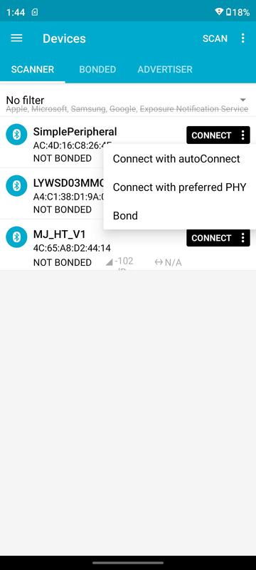
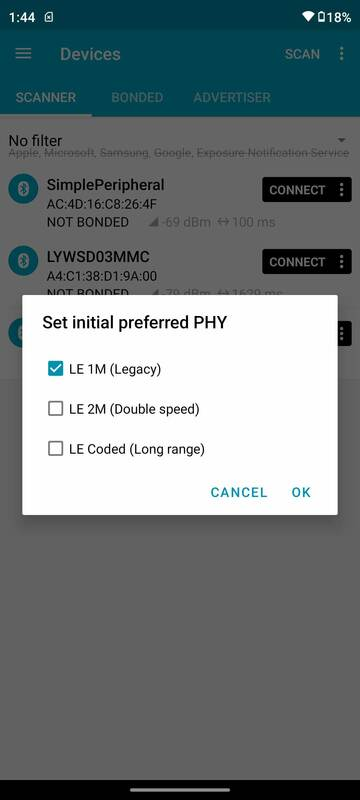

# 使用nRF Connect调试

 

## 1 nRF Connect

nRF Connect是Nordic公司发布的一款App，在Google官方的Google Play可以下载到。可能因为Nordic和TI是BLE领域的主要竞争对手，TI所有开发测试文档都未提及该应用，而是另外推荐一款第三方软件LightBlue用于调试BLE程序。

LightBlue操作简单，界面设计也更直觉友好，但对于BLE Audio Recorder项目，LightBlue无法支持协商MTU，所以无法使用。除协商MTU之外，nRF Connect还支持选择PHY，还可以LOG全部传输数据，这些都是对BLE Audio Recorder调试很有帮助的。

本文档叙述使用nRF Connect调试的方法和注意事项。

 

## 2 打印输出

当前固件在源代码一级支持配置3种打印输出方式，其中两种用于打印ADPCM语音数据，检查录音路径（write path）和读取录音数据路径（read path）上的数据正确性。这两种方式主要是固件开发者自己Debug使用。

第三种打印方式开放给所有参与开发测试的人员使用；它以固件开发者定义的格式从串口打印数据（JTAG的TDO/TDI配置为串口，下述）。该打印可以输出：

1. 所有write path上的写入flash的地址，包括sector，sector内的偏移量，写入数据的大小；
2. 所有read path上从flash读取数据的地址，包括sector，sector内的偏移量，读取数据的大小；
3. 蓝牙notification连接状态；
4. 所有蓝牙指令；
5. 所有蓝牙指令执行后设备的内部状态变化，完全忠实打印从BLE输出的`Status`数据包内容，这样调试人员不用在nRF Connect上自己解析这个数据包，没有工具软件解析很麻烦；

 

出于功耗考虑，最终发布的产品版本不会使用任何一种打印输出。但配合nRF Connect调试时，使用有打印输出的固件版本会更方便。本项目在发布初期，各方开发者主要做功能和性能测试时，均发布带有打印输出的版本。

 

### 2.1 串口配置

固件把芯片的`IOID_6`配置为串口输出的TX引脚，开发者将该引脚连接USB-serial Adaptor的RX引脚即可。原理图上`IOID_6`的引脚编号为16，网络名`TDO`，在7 pin的接口上，`TDO`是远离`GND`（方型焊盘）一侧的第三个pin。

> 使用XDS110 Debugger调试CC2640R2时实际使用的接口是2线的cJTAG，`TDO`和`TDI`不用。这两个pin脚在7 pin接口上，刚好可以做UART Log。

 

串口输出Log使用的baud rate很高，是1.5Mbps（1,500,000），在Linux上minicom支持该baud rate，使用Windows平台的开发者要自己找到合适的串口工具使用，文本打印量很大，需要串口工具能开很大的缓冲区接收信息。

 

## 3 nRF Connect使用

### PHY rate
在搜索和连接界面上，nRF Connect允许用户选择PHY设置，如下图所示。点击`connect`按钮上右侧的`more`（竖排的三个圆点）图标，选择`Connect with preferred PHY`可以指定使用的PHY rate。理论上强制LE 2M应该传输速度更快，实际上只有手机和Microphone靠的很近的时候比较明显；固件开发者不建议在使用nRF Connect调试时手工设定PHY rate，该软件可以自动调整PHY rate，可以在该软件的Log里看到PHY rate的变化（在1M和2M之间来回切换）。

 

### MTU negotiation
在主界面上点击左上角的菜单按钮打开侧面的菜单，选择`Settings`，选择`Connectivity`，然后打开`Auto requst maximum MTU`功能；该功能缺省是关闭的。必须打开该功能才能正常通讯，否则Notification发出的两种数据包都无法接收完整。

