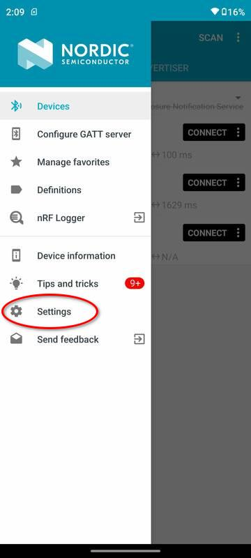

# 使用nRF Connect调试

<br/>

## 1 nRF Connect

nRF Connect是Nordic公司发布的一款App，在Google官方的Google Play可以下载到。可能因为Nordic和TI是BLE领域的主要竞争对手，TI所有开发测试文档都未提及该应用，而是另外推荐一款第三方软件LightBlue用于调试BLE程序。

LightBlue操作简单，界面设计也更直觉友好，但对于BLE Audio Recorder项目，LightBlue无法支持协商MTU，所以无法使用。除协商MTU之外，nRF Connect还支持选择PHY，还可以LOG全部传输数据，这些都是对BLE Audio Recorder调试很有帮助的。

本文档叙述使用nRF Connect调试的方法和注意事项。

<br/>

## 2 打印输出

当前固件在源代码一级支持配置3种打印输出方式，其中两种用于打印ADPCM语音数据，检查录音路径（write path）和读取录音数据路径（read path）上的数据正确性。这两种方式主要是固件开发者自己Debug使用。

第三种打印方式开放给所有参与开发测试的人员使用；它以固件开发者定义的格式从串口打印数据（JTAG的TDO/TDI配置为串口，下述）。该打印可以输出：

1. 所有write path上的写入flash的地址，包括sector，sector内的偏移量，写入数据的大小；
2. 所有read path上从flash读取数据的地址，包括sector，sector内的偏移量，读取数据的大小；
3. 蓝牙notification连接状态；
4. 所有蓝牙指令；
5. 所有蓝牙指令执行后设备的内部状态变化，完全忠实打印从BLE输出的`Status`数据包内容，这样调试人员不用在nRF Connect上自己解析这个数据包，没有工具软件解析很麻烦；

<br/>

出于功耗考虑，最终发布的产品版本不会使用任何一种打印输出。但配合nRF Connect调试时，使用有打印输出的固件版本会更方便。本项目在发布初期，各方开发者主要做功能和性能测试时，均发布带有打印输出的版本。

<br/>

### 2.1 串口配置

固件把芯片的`IOID_6`配置为串口输出的TX引脚，开发者将该引脚连接USB-serial Adaptor的RX引脚即可。原理图上`IOID_6`的引脚编号为16，网络名`TDO`，在7 pin的接口上，`TDO`是远离`GND`（方型焊盘）一侧的第三个pin。

> 使用XDS110 Debugger调试CC2640R2时实际使用的接口是2线的cJTAG，`TDO`和`TDI`不用。这两个pin脚在7 pin接口上，刚好可以做UART Log。

<br/>

串口输出Log使用的baud rate很高，是1.5Mbps（1,500,000），在Linux上minicom支持该baud rate，使用Windows平台的开发者要自己找到合适的串口工具使用，文本打印量很大，需要串口工具能开很大的缓冲区接收信息。

<br/>

## 3 nRF Connect使用

### 3.1 PHY rate
在搜索和连接界面上，nRF Connect允许用户选择PHY设置，如下图所示。点击`connect`按钮上右侧的`more`（竖排的三个圆点）图标，选择`Connect with preferred PHY`可以指定使用的PHY rate。理论上强制LE 2M应该传输速度更快，实际上只有手机和Microphone靠的很近的时候比较明显；固件开发者不建议在使用nRF Connect调试时手工设定PHY rate，该软件可以自动调整PHY rate，可以在该软件的Log里看到PHY rate的变化（在1M和2M之间来回切换）。

 

### 3.2 MTU negotiation
在主界面上点击左上角的菜单按钮打开侧面的菜单，选择`Settings`，选择`Connectivity`，然后打开`Auto requst maximum MTU`功能；该功能缺省是关闭的。必须打开该功能才能正常通讯，否则Notification发出的两种数据包都无法接收完整。

  


### 3.3 连接设备
回到主界面，点击`connect`按钮，和设备建立蓝牙连接，如下图所示。和大多数BLE调试程序不同，nRF Connect以最“原始”的方式显示数据。在BLE数据协议设计上，数据和用于描述数据的元数据（`metadata`）使用同样格式；蓝牙标准使用预定义ID（或UUID）的值表达特殊属性。例如图中短ID`0x1800`表示Generic Access服务，`0x1801`表示Generic Attribute服务。

<br/>

图中显示为Unknown Service的是设备固件自定义的蓝牙服务，使用128bit长ID（即UUID）。点开后可以看到该服务包含了一个自定义的Characteristic，它包含两个描述符；其中`0x2902`是Client Characteristic Configuration，即CCCD，是用于实现Notification/Indication的。所谓客户端打开Notification（在LightBlue里称之为subscribe），即是客户端向该属性写入值。CCCD是每客户端状态，如果设备支持多个蓝牙客户端同时建立连接，一个客户端写入CCCD的值仅对它自己有效，即一个客户端打开Notification后，Char的值变化仅会发送给该客户端，不会发送给其它同时建立蓝牙连接的客户端。

<br/>

`0x2901`对应的Characteristic User Description描述符就是该Char的名字，点击读按钮（向下的箭头加一个横线是读，向上的箭头加一个横线是写，多个向下的箭头是打开Notification），可以看到这个Char的名字是`audio`，在大多数BLE调试程序里都会自动解析这个值并直接显示在Characteristic上（而不是显示Unknown Characteristic），但nRF Connect主要是给BLE固件开发工程师使用的，它让开发者更容易看到哪里配置错了。

<br />

最后要说明的是注意Unknown Characteristic下面有一行Properties的小字，后面写着NOTIFY和WRITE，表示该Char支持这两种BLE操作。固件程序约定，必须打开Notification，WRITE操作才执行，否则输入的数据都会被抛弃。

 


### 3.4 启动后的设备日志打印

如果连接了串口到PC，当前固件版本能看到设备启动后从串口输出的打印信息。

- `counter`是从Flash载入的当前即将写入的sector地址；
- `recordings`是从Flash载入的录音分段信息；
- `recStart`和`recPos`是初始化的（即将开始的）录音的起始点；以上可参考接口说明文档；

<br/>

录音时写入flash的操作的详细信息都有打印输出（nvs write, nvs erase, etc）；当前固件内部有设置一次录音的最长时间为10秒钟，该设置最终会取消，在调试初期为防止程序错误导致无限循环录音设置此值，10秒钟的录音足够调试使用了。在串口看到打印停止后即可执行蓝牙操作。不停止也可以操作但是就要回卷屏幕查找所需的打印信息了。

```
counter     : 0x00000571
recordings  : 0x00000478 0x0000048c 0x0000048d 0x000004a1 0x000004a2
              0x000004b6 0x000004b7 0x000004cb 0x000004cc 0x000004e0
              0x000004e1 0x000004f5 0x000004f6 0x0000050a 0x0000050b
              0x0000051f 0x00000520 0x00000534 0x00000535 0x00000549
              0x0000055d
recStart    : 0x00000571
recPos      : 0x00000571
event       : AUDIO_START_REC
 - nvs write, pos 0x00000571, cnt 000003, cntInSect 03, offset 0x00571000 (%4k 0000), size 256
 - nvs write, pos 0x00000571, cnt 000007, cntInSect 07, offset 0x00571100 (%4k 0256), size 160
 - nvs write, pos 0x00000571, cnt 000011, cntInSect 11, offset 0x005711a0 (%4k 0416), size 160
 - nvs write, pos 0x00000571, cnt 000015, cntInSect 15, offset 0x00571240 (%4k 0576), size 160
 - nvs write, pos 0x00000571, cnt 000019, cntInSect 19, offset 0x005712e0 (%4k 0736), size 160
 - nvs write, pos 0x00000571, cnt 000023, cntInSect 23, offset 0x00571380 (%4k 0896), size 160
 - nvs write, pos 0x00000571, cnt 000027, cntInSect 27, offset 0x00571420 (%4k 1056), size 160
 - nvs write, pos 0x00000571, cnt 000031, cntInSect 31, offset 0x005714c0 (%4k 1216), size 160
 - nvs write, pos 0x00000571, cnt 000035, cntInSect 35, offset 0x00571560 (%4k 1376), size 160
 - nvs write, pos 0x00000571, cnt 000039, cntInSect 39, offset 0x00571600 (%4k 1536), size 160
 - nvs write, pos 0x00000571, cnt 000043, cntInSect 43, offset 0x005716a0 (%4k 1696), size 160
 - nvs write, pos 0x00000571, cnt 000047, cntInSect 47, offset 0x00571740 (%4k 1856), size 160
 - nvs write, pos 0x00000571, cnt 000051, cntInSect 51, offset 0x005717e0 (%4k 2016), size 160
 - nvs write, pos 0x00000571, cnt 000055, cntInSect 55, offset 0x00571880 (%4k 2176), size 160
 - nvs write, pos 0x00000571, cnt 000059, cntInSect 59, offset 0x00571920 (%4k 2336), size 160
 - nvs write, pos 0x00000571, cnt 000063, cntInSect 63, offset 0x005719c0 (%4k 2496), size 160
 - nvs write, pos 0x00000571, cnt 000067, cntInSect 67, offset 0x00571a60 (%4k 2656), size 160
 - nvs write, pos 0x00000571, cnt 000071, cntInSect 71, offset 0x00571b00 (%4k 2816), size 160
 - nvs write, pos 0x00000571, cnt 000075, cntInSect 75, offset 0x00571ba0 (%4k 2976), size 160
 - nvs write, pos 0x00000571, cnt 000079, cntInSect 79, offset 0x00571c40 (%4k 3136), size 160
 - nvs write, pos 0x00000571, cnt 000083, cntInSect 83, offset 0x00571ce0 (%4k 3296), size 160
 - nvs write, pos 0x00000571, cnt 000087, cntInSect 87, offset 0x00571d80 (%4k 3456), size 160
 - nvs write, pos 0x00000571, cnt 000091, cntInSect 91, offset 0x00571e20 (%4k 3616), size 160
 - nvs write, pos 0x00000571, cnt 000095, cntInSect 95, offset 0x00571ec0 (%4k 3776), size 160
 - nvs write, pos 0x00000571, cnt 000099, cntInSect 99, offset 0x00571f60 (%4k 3936), size 160
new sector  : pos 0x00000572, counter 0x00000572
 - nvs erase,     0x00572000 (%4k 0)

(omitted)

 - nvs write, pos 0x00000584, cnt 001903, cntInSect 03, offset 0x00584000 (%4k 0000), size 256
 - nvs write, pos 0x00000584, cnt 001907, cntInSect 07, offset 0x00584100 (%4k 0256), size 160
 - nvs write, pos 0x00000584, cnt 001911, cntInSect 11, offset 0x005841a0 (%4k 0416), size 160
 - nvs write, pos 0x00000584, cnt 001915, cntInSect 15, offset 0x00584240 (%4k 0576), size 160
 - nvs write, pos 0x00000584, cnt 001919, cntInSect 19, offset 0x005842e0 (%4k 0736), size 160
 - nvs write, pos 0x00000584, cnt 001923, cntInSect 23, offset 0x00584380 (%4k 0896), size 160
 - nvs write, pos 0x00000584, cnt 001927, cntInSect 27, offset 0x00584420 (%4k 1056), size 160
 - nvs write, pos 0x00000584, cnt 001931, cntInSect 31, offset 0x005844c0 (%4k 1216), size 160
 - nvs write, pos 0x00000584, cnt 001935, cntInSect 35, offset 0x00584560 (%4k 1376), size 160
 - nvs write, pos 0x00000584, cnt 001939, cntInSect 39, offset 0x00584600 (%4k 1536), size 160
 - nvs write, pos 0x00000584, cnt 001943, cntInSect 43, offset 0x005846a0 (%4k 1696), size 160
 - nvs write, pos 0x00000584, cnt 001947, cntInSect 47, offset 0x00584740 (%4k 1856), size 160
 - nvs write, pos 0x00000584, cnt 001951, cntInSect 51, offset 0x005847e0 (%4k 2016), size 160
 - nvs write, pos 0x00000584, cnt 001955, cntInSect 55, offset 0x00584880 (%4k 2176), size 160
 - nvs write, pos 0x00000584, cnt 001959, cntInSect 59, offset 0x00584920 (%4k 2336), size 160
 - nvs write, pos 0x00000584, cnt 001963, cntInSect 63, offset 0x005849c0 (%4k 2496), size 160
 - nvs write, pos 0x00000584, cnt 001967, cntInSect 67, offset 0x00584a60 (%4k 2656), size 160
 - nvs write, pos 0x00000584, cnt 001971, cntInSect 71, offset 0x00584b00 (%4k 2816), size 160
 - nvs write, pos 0x00000584, cnt 001975, cntInSect 75, offset 0x00584ba0 (%4k 2976), size 160
 - nvs write, pos 0x00000584, cnt 001979, cntInSect 79, offset 0x00584c40 (%4k 3136), size 160
 - nvs write, pos 0x00000584, cnt 001983, cntInSect 83, offset 0x00584ce0 (%4k 3296), size 160
 - nvs write, pos 0x00000584, cnt 001987, cntInSect 87, offset 0x00584d80 (%4k 3456), size 160
 - nvs write, pos 0x00000584, cnt 001991, cntInSect 91, offset 0x00584e20 (%4k 3616), size 160
 - nvs write, pos 0x00000584, cnt 001995, cntInSect 95, offset 0x00584ec0 (%4k 3776), size 160
 - nvs write, pos 0x00000584, cnt 001999, cntInSect 99, offset 0x00584f60 (%4k 3936), size 160
new sector  : pos 0x00000585, counter 0x00000585
 - nvs erase,     0x00585000 (%4k 0)
max rec sect reached, before stopRecording(). start 0x00000571, pos 0x00000585
                      after  stopRecording(). start 0x00000585, pos 0x00000585

```

<br/>

### 3.5 查看Status

