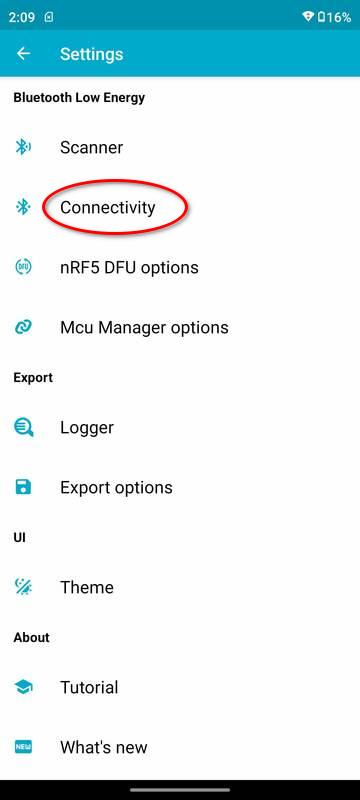

# 使用nRF Connect调试

<br/>

## 1 nRF Connect

nRF Connect是Nordic公司开发的一款BLE App，在Google官方的Google Play可以下载到。TI的官方开发测试文档都未提及该应用，而是推荐另一个第三方软件LightBlue用于调试BLE程序。

LightBlue操作简单，界面设计比nRF Connect更直觉友好，但对于录音项目，LightBlue无法支持协商MTU，所以无法使用。除协商MTU之外，nRF Connect还支持选择PHY，还可以LOG全部传输数据，这些调试所需的必要特性。

本文档叙述使用nRF Connect调试的方法和注意事项。

阅读本文档需要使用者阅读接口定义文档，否则无法理解BLE和串口输出的内容含义。

<br/>

## 2 打印输出

当前固件在源代码一级支持配置3种打印输出方式，其中两种用于打印ADPCM语音数据，检查录音路径（write path）和读取录音数据路径（read path）上的数据正确性。这两种方式主要是固件开发者自己Debug使用。

第三种打印方式开放给所有参与开发测试的人员使用。该打印可以输出：

1. 所有write path上的写入flash的地址，包括sector，sector内的偏移量，写入数据的大小；
2. 所有read path上从flash读取数据的地址，包括sector，sector内的偏移量，读取数据的大小；
3. 蓝牙notification状态变化；
5. 打印从BLE输出的`Status`数据包内容，这样调试人员不用在nRF Connect上自己解析这个数据包；App开发者可以对比自己程序解析的结果和打印结果是否一致；

<br/>

出于功耗考虑，最终发布的产品版本不会使用打印输出。但配合nRF Connect调试时，使用有打印输出的固件会更方便。

<br/>

### 2.1 串口配置

固件把芯片的`IOID_6`配置为串口输出的TX引脚，该引脚连接至USB串口适配器上的RX引脚即可，使用1.8V电平。原理图上`IOID_6`的引脚编号为16，网络名`TDO`，在7 pin的接口上，`TDO`是远离`GND`（方型焊盘）一侧的第三个pin。

> 使用XDS110 Debugger调试CC2640R2时实际使用的接口是2线的cJTAG，`TDO`和`TDI`不用。这两个Pin脚在7 pin接口上引出，刚好可以配置为uart使用。

<br/>

串口输出Log使用的baud rate是1.5Mbps（1,500,000），在Linux上minicom支持该baud rate，使用Windows平台的开发者要自己找到合适的串口工具使用，文本打印量很大，需要串口工具能开很大的缓冲区接收信息。

<br/>

## 3 nRF Connect使用

### 3.1 PHY rate
在搜索和连接界面上，nRF Connect允许用户选择PHY设置，如下图所示。点击`connect`按钮上右侧的`more`（竖排的三个圆点）图标，选择`Connect with preferred PHY`可以指定使用的PHY rate。理论上强制LE 2M应该传输速度更快，实际上只有手机和Microphone靠的很近的时候比较明显；固件开发者不建议在使用nRF Connect调试时手工设定PHY rate，该软件可以自动调整PHY rate，可以在该软件的Log里看到PHY rate的变化（在1M和2M之间来回切换）。

 

### 3.2 MTU negotiation
在主界面上点击左上角的菜单按钮打开侧面的菜单，选择`Settings`，选择`Connectivity`，然后打开`Auto requst maximum MTU`功能；该功能缺省是关闭的。必须打开该功能才能正常通讯，否则Notification发出的两种数据包都无法接收完整。

<br/>

  


### 3.3 连接设备
回到主界面，点击`connect`按钮，和设备建立蓝牙连接，如下图所示。

<br/>

图中短ID`0x1800`表示Generic Access服务，`0x1801`表示Generic Attribute服务，这两个ID对应的服务是蓝牙协议预定义的（或者说是蓝牙组织预分配的）。显示为Unknown Service的是设备固件自定义的蓝牙服务，使用128bit长ID（即UUID）。点开后可以看到该服务包含了一个自定义的Characteristic（以下简称Char）。

<br/>这个Char有两个描述符，其中ID为`0x2902`的描述符是`Client Characteristic Configuration`（CCC），是用于实现Notification/Indication的。所谓客户端打开Notification（在LightBlue里称之为subscribe），即是客户端向该描述符写入值（这是底层协议栈实现的，App开发者不会需要显示调用API）。CCC是每客户端状态，如果设备支持多个蓝牙客户端同时建立连接，一个客户端写入CCC的值仅对它自己有效，即一个客户端打开Notification后，Char的值变化仅会发送给该客户端，不会发送给其它同时建立蓝牙连接的客户端。

<br/>

`0x2901`对应的`Characteristic User Description`（CUD）描述符就是该Char的名字，点击读按钮（向下的箭头加一个横线是读，向上的箭头加一个横线是写，多个向下的箭头是打开Notification），可以看到这个Char的名字是`audio`。

<br />

以上几段内容开发者和调试者都不必完全理解；写在这里主要是想让开发者知道nRF Connect使用了底层且原始的方式实现界面。比如大多数BLE客户端程序都会自动解析CUD并显示在界面上，而不是象nRF Connect这样只显示一个`Unknown Characteristic`，表示这个Char不是蓝牙组织预定的，是设备开发者自定义的。nRF Connect的这种设计对普通用户并不友好，这个软件主要是给BLE固件开发工程师使用的。

<br />

最后要说明的是注意`Unknown Characteristic`下面有一行`Properties`的小字，后面写着`NOTIFY`和`WRITE`，表示该Char支持这两种BLE操作。固件程序约定，必须打开Notification，`WRITE`操作才执行，否则输入的指令都会被抛弃。

<br />

 


### 3.4 启动后的设备日志打印

设备启动后从串口输出的打印信息如下所示，其中：

- `counter`是从Flash载入的当前即将写入的sector地址；
- `recordings`是从Flash载入的录音分段信息；
- `recStart`和`recPos`是初始化的（即将开始的）录音的起始点；

以上可参考接口说明文档理解。

<br/>

录音时写入flash的操作的详细信息都有打印输出（nvs write, nvs erase, etc）；**注意当前固件内部设置一次录音最长时间为10秒钟**，该设置最终会取消，但在调试初期为防止程序错误导致无限循环设置此值，10秒钟录音足够调试使用，在App初步完成测试后固件会取消该设置。

```
counter     : 0x00000571
recordings  : 0x00000478 0x0000048c 0x0000048d 0x000004a1 0x000004a2
              0x000004b6 0x000004b7 0x000004cb 0x000004cc 0x000004e0
              0x000004e1 0x000004f5 0x000004f6 0x0000050a 0x0000050b
              0x0000051f 0x00000520 0x00000534 0x00000535 0x00000549
              0x0000055d
recStart    : 0x00000571
recPos      : 0x00000571
event       : AUDIO_START_REC
 - nvs write, pos 0x00000571, cnt 000003, cntInSect 03, offset 0x00571000 (%4k 0000), size 256
 - nvs write, pos 0x00000571, cnt 000007, cntInSect 07, offset 0x00571100 (%4k 0256), size 160
 - nvs write, pos 0x00000571, cnt 000011, cntInSect 11, offset 0x005711a0 (%4k 0416), size 160
 - nvs write, pos 0x00000571, cnt 000015, cntInSect 15, offset 0x00571240 (%4k 0576), size 160
 - nvs write, pos 0x00000571, cnt 000019, cntInSect 19, offset 0x005712e0 (%4k 0736), size 160
 - nvs write, pos 0x00000571, cnt 000023, cntInSect 23, offset 0x00571380 (%4k 0896), size 160
 - nvs write, pos 0x00000571, cnt 000027, cntInSect 27, offset 0x00571420 (%4k 1056), size 160
 - nvs write, pos 0x00000571, cnt 000031, cntInSect 31, offset 0x005714c0 (%4k 1216), size 160
 - nvs write, pos 0x00000571, cnt 000035, cntInSect 35, offset 0x00571560 (%4k 1376), size 160
 - nvs write, pos 0x00000571, cnt 000039, cntInSect 39, offset 0x00571600 (%4k 1536), size 160
 - nvs write, pos 0x00000571, cnt 000043, cntInSect 43, offset 0x005716a0 (%4k 1696), size 160
 - nvs write, pos 0x00000571, cnt 000047, cntInSect 47, offset 0x00571740 (%4k 1856), size 160
 - nvs write, pos 0x00000571, cnt 000051, cntInSect 51, offset 0x005717e0 (%4k 2016), size 160
 - nvs write, pos 0x00000571, cnt 000055, cntInSect 55, offset 0x00571880 (%4k 2176), size 160
 - nvs write, pos 0x00000571, cnt 000059, cntInSect 59, offset 0x00571920 (%4k 2336), size 160
 - nvs write, pos 0x00000571, cnt 000063, cntInSect 63, offset 0x005719c0 (%4k 2496), size 160
 - nvs write, pos 0x00000571, cnt 000067, cntInSect 67, offset 0x00571a60 (%4k 2656), size 160
 - nvs write, pos 0x00000571, cnt 000071, cntInSect 71, offset 0x00571b00 (%4k 2816), size 160
 - nvs write, pos 0x00000571, cnt 000075, cntInSect 75, offset 0x00571ba0 (%4k 2976), size 160
 - nvs write, pos 0x00000571, cnt 000079, cntInSect 79, offset 0x00571c40 (%4k 3136), size 160
 - nvs write, pos 0x00000571, cnt 000083, cntInSect 83, offset 0x00571ce0 (%4k 3296), size 160
 - nvs write, pos 0x00000571, cnt 000087, cntInSect 87, offset 0x00571d80 (%4k 3456), size 160
 - nvs write, pos 0x00000571, cnt 000091, cntInSect 91, offset 0x00571e20 (%4k 3616), size 160
 - nvs write, pos 0x00000571, cnt 000095, cntInSect 95, offset 0x00571ec0 (%4k 3776), size 160
 - nvs write, pos 0x00000571, cnt 000099, cntInSect 99, offset 0x00571f60 (%4k 3936), size 160
new sector  : pos 0x00000572, counter 0x00000572
 - nvs erase,     0x00572000 (%4k 0)

(omitted)

 - nvs write, pos 0x00000584, cnt 001903, cntInSect 03, offset 0x00584000 (%4k 0000), size 256
 - nvs write, pos 0x00000584, cnt 001907, cntInSect 07, offset 0x00584100 (%4k 0256), size 160
 - nvs write, pos 0x00000584, cnt 001911, cntInSect 11, offset 0x005841a0 (%4k 0416), size 160
 - nvs write, pos 0x00000584, cnt 001915, cntInSect 15, offset 0x00584240 (%4k 0576), size 160
 - nvs write, pos 0x00000584, cnt 001919, cntInSect 19, offset 0x005842e0 (%4k 0736), size 160
 - nvs write, pos 0x00000584, cnt 001923, cntInSect 23, offset 0x00584380 (%4k 0896), size 160
 - nvs write, pos 0x00000584, cnt 001927, cntInSect 27, offset 0x00584420 (%4k 1056), size 160
 - nvs write, pos 0x00000584, cnt 001931, cntInSect 31, offset 0x005844c0 (%4k 1216), size 160
 - nvs write, pos 0x00000584, cnt 001935, cntInSect 35, offset 0x00584560 (%4k 1376), size 160
 - nvs write, pos 0x00000584, cnt 001939, cntInSect 39, offset 0x00584600 (%4k 1536), size 160
 - nvs write, pos 0x00000584, cnt 001943, cntInSect 43, offset 0x005846a0 (%4k 1696), size 160
 - nvs write, pos 0x00000584, cnt 001947, cntInSect 47, offset 0x00584740 (%4k 1856), size 160
 - nvs write, pos 0x00000584, cnt 001951, cntInSect 51, offset 0x005847e0 (%4k 2016), size 160
 - nvs write, pos 0x00000584, cnt 001955, cntInSect 55, offset 0x00584880 (%4k 2176), size 160
 - nvs write, pos 0x00000584, cnt 001959, cntInSect 59, offset 0x00584920 (%4k 2336), size 160
 - nvs write, pos 0x00000584, cnt 001963, cntInSect 63, offset 0x005849c0 (%4k 2496), size 160
 - nvs write, pos 0x00000584, cnt 001967, cntInSect 67, offset 0x00584a60 (%4k 2656), size 160
 - nvs write, pos 0x00000584, cnt 001971, cntInSect 71, offset 0x00584b00 (%4k 2816), size 160
 - nvs write, pos 0x00000584, cnt 001975, cntInSect 75, offset 0x00584ba0 (%4k 2976), size 160
 - nvs write, pos 0x00000584, cnt 001979, cntInSect 79, offset 0x00584c40 (%4k 3136), size 160
 - nvs write, pos 0x00000584, cnt 001983, cntInSect 83, offset 0x00584ce0 (%4k 3296), size 160
 - nvs write, pos 0x00000584, cnt 001987, cntInSect 87, offset 0x00584d80 (%4k 3456), size 160
 - nvs write, pos 0x00000584, cnt 001991, cntInSect 91, offset 0x00584e20 (%4k 3616), size 160
 - nvs write, pos 0x00000584, cnt 001995, cntInSect 95, offset 0x00584ec0 (%4k 3776), size 160
 - nvs write, pos 0x00000584, cnt 001999, cntInSect 99, offset 0x00584f60 (%4k 3936), size 160
new sector  : pos 0x00000585, counter 0x00000585
 - nvs erase,     0x00585000 (%4k 0)
max rec sect reached, before stopRecording(). start 0x00000571, pos 0x00000585
                      after  stopRecording(). start 0x00000585, pos 0x00000585

```

<br/>

在串口看到上电后的第一次10秒自动录音打印停止后，即可尝试执行下面的蓝牙指令。（不停止也可以操作但要回卷屏幕查找所需的打印信息）

<br/>

### 3.5 发送命令

如下图所示，可以点击写入按钮，在对话框中输入`00`，按SEND；`00`是`NO_OP`指令，不执行任何操作，但可以获得设备返回的内部信息。

<br/>

 

<br/>

在界面上可以看到返回的数据包，`Status`数据包的大小是112字节。在串口打印界面上有对这个数据包的解析。这里比较有用的是对`recordings`的解析。

```
status: recordings 0000048c 0000048d 000004a1 000004a2 000004b6
                   000004b7 000004cb 000004cc 000004e0 000004e1
                   000004f5 000004f6 0000050a 0000050b 0000051f
                   00000520 00000534 00000535 00000549 0000055d
                   00000571
        recording: 0, recStart 00000585, recPos 00000585
        reading: 0, readStart 00000000, readEnd 00000000, major: 00000000, minor 00000000
```

例如：

最后一段录音的起始地址是`recordings`的最后一项`0x00000571`，结束地址是`recStart`所在的`0x00000585`，在使用读取命令时，拼出来的命令就是

`04 71 05 00 00 85 05 00 00 `

其中第一个字节`04`是命令的编码，第二到第五个字节是Little Endian的读取起点位置（包含），后面四个字节是Little Endian的读取终点位置（不包含）。

<br/>

### 3.6 读取录音数据

读取录音数据可以根据业务要求，根据`Status`命令里提供的`recordings`数组分段提取；简单测试时可直接使用`04`命令，不提供起始点和结束点参数，这会提取全部语音数据。该操作会在串口产生大量打印。如果要中止读取可以发送`03`命令。

<br/>

在串口打印中能看到不少下述错误信息：

```
read offset 1222464 (0012a740) @ major 298 (0000012a) minor 11
read offset 1222624 (0012a7e0) @ major 298 (0000012a) minor 12
------ notify failed, nomem, where 0
------ notify failed, nomem, where 1
------ notify failed, nomem, where 1
------ notify failed, nomem, where 1
------ notify failed, nomem, where 1
------ notify failed, nomem, where 1
```


该信息不是真正的错误。Notification在CC2640R2上是一个异步通讯完成的请求。应用必须快速填充蓝牙的PDU Buffer，最多6个，全部填满后**只能等待全部Buffer清空才能继续填充**；应用程序无从得知何时Buffer被清空，只能高速尝试填充，所以即使一切正常，也会看到`notify failed`消息，在通讯遇到干扰时，会看到一长串的该消息，说明Buffer里的数据包用了较长的时间传输完成。

<br/>

### 3.7 查看nRF Connect的Log

可以从界面右上角的菜单按钮进入，选择`Show log`，或者可以用手指在界面上向右滑动，也可以看到Log界面。在Log界面的左下角有一个弹出菜单，可选择Log的等级，选择DEBUG可以看到最多的Log信息。

 


重要的Log信息有这样几种。

1. 在建立连接后，在Log里应该能看到MTU协商到了251字节。这是必须的要求，否则通讯无法正常完成。
1. 可以看到PHY rate的变化。nRF Connect会自动调整PHY rate。
3. 在读取的时候，Log里有大量的`ADPCM_DATA`数据包，该数据包的最初四个字节是Little Endian格式的Sector地址（Major），第五个字节是Sector内的Minor地址；这些地址应该是连续的，Minor从`0x00`到`0x18`（十六进制的24），然后进位累加`Major`地址。固件开发者仔细检查过nRF Connect Log里的数据包地址，未曾发现过丢包的现象，这符合BLE的协议规范，Notification在链路层是有QoS的，如果未能正确接收会自动重发。

以下图为例，绿色部分是一个ADPCM_DATA数据包。最初四个字节表示sector地址是`0x00000139`，后面的十六进制的`16`是十进制的22，表示这是Sector（含4000字节ADPCM数据）拆成的25个160字节的BLE数据包里的第23个（从0开始的）。


<br/>


### 3.8 UI操作问题

nRF Connect功能强大，但是它的UI设计有些小瑕疵。

1. 写入，打开/关闭通知，这两个图标按钮很难按，需要用指尖轻触，减少指尖和屏幕的接触面积；
2. 打开Log后回到主界面，可以轻轻点击最右侧边缘露出的“上层”界面；最新的Android设计上，从边缘进入手指滑动被系统解释成Back操作，导致这里很难用滑动返回上层UI。


